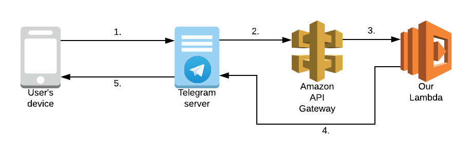

# Serverless Chatbot: Part One

In this part we will create a working Telegram chatbot and deploy it to the AWS. The chatbot will be very simple at
this stage but hey everyone needs to start somewhere!

## Prerequisites

Before starting make sure you have the following:

* Basic skills with command line (very simple stuff like how to navigate between directories and how to execute commands)
* A text editor or IDE of your choice (we are going to write a bit of Javascript)
* [curl]() (you can check if you have curl by running `curl --version`) or any other HTTP client (eg. Postman, etc.)
* [NodeJS](https://nodejs.org) (this should also include the node package manager **npm**)
* **AWS access keys** (this includes the access key id and the secret access key)
* A [Telegram](https://telegram.org/) account and a client (it is recommended that you have the client on the same computer you are using right now)


## Goal of part one

Our goal here is to get started with the chatbot development by creating a simple chatbot and deploying it to AWS.

## Instructions

### 1. Installing Serverless Framework

For building and deploying our chatbot we will be using the [Serverless Framework](https://serverless.com/). You can download serverless framework by running:

```bash
npm install serverless -g
```

Then we can create our project by running:

```bash
serverless create --template aws-nodejs --path my-chatbot
```

This will create an empty serverless project based on the aws-nodejs template. The project will be placed in directory
called "my-chatbot". You can change the name of the folder to whatever you like.

In the directory we will see two new files:

* `serverless.yml` - This is the configuration file for the serverless framework application. It contains the definition of one or multiple
    AWS lambda functions as well as any other resources our application might need. At this point we can see that there is already one lambda function
    defined called "hello" with its "handler" set to `handler.hello`. This means that the lambda function will start its execution from the function
    called `hello` in the file `handler.js`.
* `handler.js` - This contains source code of our first Lambda function. We will be modifying this soon.

### 2. Deploying the Lambda function

In order to deploy the Lambda function we need to make sure that the serverless can see our AWS access keys. Easiest way
to do this is to set the environmental variables `AWS_ACCESS_KEY_ID` and `AWS_SECRET_ACCESS_KEY`. You can do that by running
these commands in your terminal:

```bash
export AWS_ACCESS_KEY_ID=<Access key ID>
export AWS_SECRET_ACCESS_KEY=<Secret access key>
```

*Be careful not to share these credentials as bad people can do bad things with them. Many people accidentally share these
credentials by commiting them to a public version control like GitHub, so be careful.*

After we have set up the credentials we can deploy our lambda with:

```bash
serverless deploy
```

This will take a moment. After this process is done we can test our new lambda function by running:

```bash
serverless invoke -f hello
```

Yay. Now our code is running in the cloud!

### 3. Listening to events

So far our function only runs when we explicitly invoke it with the serverless command. In order for it to be usefull we
need to add an event listener which will execute our function whenever an event occurs. There are plenty of different events
to choose from (HTTP request to the API Gateway, file creation in S3, row change in DynamoDB, Kinesis data streams, etc.) but
for now we'll stick to listening HTTP requests.

Open up `serverless.yml` and you should see the following function definition:

```yaml
functions:                  # This starts the functions section which defines all lambda functions in our application
  hello:                    # This line defines a function named "hello"
    handler: handler.hello  # This sets the function hello in file handler.js as the entrypoint of the lambda function
```

We will need to extend this function definition to include an event listener for HTTP requests. This will create an Amazon
API Gateway for us which routes messages sent to the endpoints we specify to our lambda function. Here's the section after the change:

```yaml
functions:
  hello:
    handler: handler.hello
    events:                 # This starts the list of event listeners. A single lambda can listen to multiple different event sources
      - http:               # http event type means a HTTP request to the amazon API Gateway
          path: execute     # This correspond to URL path /execute
          method: get       # The lambda will listen for GET requests (other possible values: post, put, delete, etc.)
```

Now with this change in place we can re-deploy the function by running again:

```bash
serverless deploy
```

After deploy you will see the newly created endpoint printed out in your terminal. It will look something like
`GET - https://xxxxxxx.execute-api.us-east-1.amazonaws.com/dev/execute`. You can open the URL in a browser and Voilà!
our lambda function is now invokable by HTTP requests.

### 4. Making a chatbot

Now that we have a lambda that can respond to HTTP requests we have everything that we need to make a simple chatbot.
Telegram bots work on the simple logic that when a user sends a message to a chatbot that message first goes to the
Telegram servers. Their server then passes that message on to a HTTP endpoint that we can define and then our bot can
respond to the user's message by calling the Telegram's API.


*(1) The user writes a message to the bot's chat which gets passed to the telegram servers. (2) The telegram server calls the HTTP endpoint we have defined
(3) The API Gateway creates an event which triggers our lambda function. (4) Our lambda function responds to the user's message by calling the telegram API.
(5) The telegram server sends our response to the user.*

In order to make this happen we need to change the code of our lambda function in `handler.js`.
